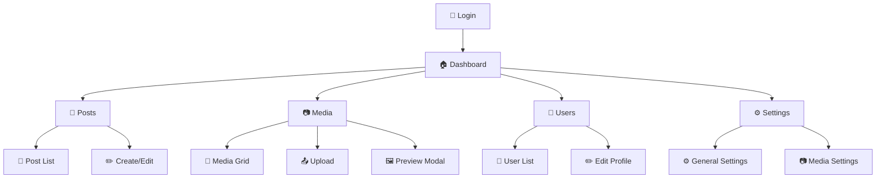

# 🗺️ CMS Component Map & File Structure

## 📱 Page Flow & Components

### 🏠 Admin Dashboard Flow


---

## 📁 Frontend Component Structure

### 🖥️ Layouts
```
layouts/
├── admin.blade.php                    🏠 Main admin wrapper
│   ├── Header: Logo + Search + Profile
│   ├── Sidebar: Navigation menu
│   └── Content: Page content area
│
├── app.blade.php                      🌐 Public site layout
└── guest.blade.php                    🔐 Auth pages layout
```

### 🧩 Reusable Components
```
components/
├── ui/
│   ├── Button.blade.php              🔲 Styled button
│   │   • Classes: primary, secondary, danger
│   │   • Sizes: sm, md, lg
│   │   • States: loading, disabled
│   │
│   ├── Input.blade.php               📝 Form input
│   │   • Types: text, email, password
│   │   • Validation: error states
│   │   • Icons: left/right placement
│   │
│   ├── Modal.blade.php               🖼️ Popup dialog
│   │   • Backdrop: blur overlay
│   │   • Animation: slide + fade
│   │   • Sizes: sm, md, lg, xl
│   │
│   ├── Select.blade.php              📋 Dropdown
│   │   • Search: filterable options
│   │   • Multi: multiple selection
│   │   • Custom: styled appearance
│   │
│   └── TextArea.blade.php            📝 Multi-line input
│       • Auto-resize: grows with content
│       • Counter: character limits
│       • Rich: TinyMCE integration
│
├── editor.blade.php                  ✏️ TinyMCE wrapper
│   • Toolbar: customizable buttons
│   • Plugins: image, link, lists, code
│   • Upload: media library integration
│
├── media-library.blade.php           📁 File browser
│   • Grid: thumbnail view
│   • List: detailed view
│   • Search: live filtering
│   • Upload: drag & drop zone
│
├── media-modal.blade.php             🖼️ Media selector
│   • Browse: existing files
│   • Upload: new files
│   • Select: single/multiple
│   • Insert: into content
│
└── delete-form.blade.php             🗑️ Delete confirmation
    • Warning: styled alert
    • Confirm: double-check
    • Cancel: escape option
```

---

## 📝 Page Components Map

### 📷 Media Page (`admin/media/index.blade.php`)
```
┌─────────────────────────────────────────┐
│ 📤 Upload Area                          │
│ • File input (hidden)                   │
│ • Drag & drop zone                      │
│ • Progress bars                         │
│ • Error messages                        │
└─────────────────────────────────────────┘

┌─────────────────────┬───────────────────┐
│ 🔍 Filters & Search │ 📊 Stats         │
│ • Search input      │ • Total files    │
│ • Type filter       │ • Storage used   │ 
│ • Date filter       │ • Recent uploads │
│ • Grid/List toggle  │                  │
├─────────────────────┤                  │
│ 📁 Media Grid       │                  │
│ • Thumbnail cards   │                  │
│ • Hover overlays    │                  │
│ • Selection states  │                  │
│ • Infinite scroll   │                  │
└─────────────────────┴───────────────────┘

Alpine.js Data:
{
  viewMode: 'grid|list',
  searchTerm: string,
  selectedType: string, 
  uploadingFiles: array,
  allMedia: array,
  filteredMedia: computed
}
```

### 📝 Post Editor (`admin/posts/create.blade.php`)
```
┌─────────────────────────────────────────┐
│ 📝 Post Form                            │
│ ┌─────────────────┬─────────────────────┐│
│ │ 📄 Content      │ 📋 Metadata        ││
│ │ • Title input   │ • Status select    ││
│ │ • Slug field    │ • Categories       ││
│ │ • Content area  │ • Tags             ││
│ │ • Media button  │ • Featured image   ││
│ │ • Preview       │ • Publish date     ││
│ └─────────────────┴─────────────────────┘│
│ 💾 Save Actions                         │
│ • Draft, Preview, Publish               │
└─────────────────────────────────────────┘
```

### ⚙️ Settings Page (`admin/settings/index.blade.php`)
```
┌─────────────────────────────────────────┐
│ ⚙️ Settings Tabs                        │
│ [General] [Media] [Mail] [Advanced]     │
├─────────────────────────────────────────┤
│ 📷 Media Settings (Active Tab)          │
│ ┌─────────────────────────────────────┐ │
│ │ Thumbnails                          │ │
│ │ ☑️ Generate [✓]  ☑️ WebP [✓]       │ │
│ │ Quality: [85] %                     │ │
│ │                                     │ │
│ │ Sizes:                              │ │
│ │ Thumb: [300]×[300] px               │ │
│ │ Medium: [600]×[600] px              │ │
│ │ Large: [1200]×[1200] px             │ │
│ │                                     │ │
│ │ Upload: [10240] KB max              │ │ 
│ │                                     │ │
│ │        [💾 Save Settings]           │ │
│ └─────────────────────────────────────┘ │
└─────────────────────────────────────────┘
```

---

## 🚀 JavaScript Component Map

### 📤 Media Upload (`resources/js/media-upload.js`)
```javascript
// 🎯 Core Functions:
window.handleUpload()          // Main entry point
├── createFileObjects()        // Generate previews  
├── updateAlpineState()        // Sync with UI
└── uploadFiles()              // Parallel uploads

uploadFileWithProgress()       // Individual file
├── createFormData()           // Prepare payload
├── trackProgress()            // Update bars
├── handleSuccess()            // Add to grid  
└── handleError()              // Show errors

// 🔧 Utilities:
getFileType()                  // image/video/pdf
getFileIcon()                  // Emoji icons
truncate()                     // Short names
```

### ✏️ Post Editor (`resources/js/post-editor.js`)
```javascript
// 📝 TinyMCE Setup:
tinymce.init({
  selector: '#content',
  plugins: [
    'image', 'link', 'lists',    // Basic formatting
    'code', 'preview',           // Advanced features  
    'media', 'table'             // Rich content
  ],
  toolbar: [
    'undo redo | bold italic',   // Basic editing
    'link image media',          // Media insertion
    'bullist numlist',           // Lists
    'code preview'               // Tools
  ]
})

// 🖼️ Media Integration:
mediaLibraryCallback()         // Open media modal
insertMedia()                  // Insert selected files
```

### 🗂️ Media Manager (`resources/js/modules/media-manager.ts`)
```typescript
class MediaManager {
  // 🔍 Search & Filter
  filterByType(type: string)
  searchFiles(term: string) 
  sortFiles(order: 'asc'|'desc')
  
  // 📁 CRUD Operations  
  uploadFiles(files: FileList)
  deleteFile(id: number)
  updateMetadata(id: number, data: object)
  
  // 🖼️ Display
  renderGrid(files: MediaFile[])
  renderList(files: MediaFile[])
  showPreview(file: MediaFile)
}
```

---

## 🗄️ Database Component Map

### 📊 Table Relationships
```sql
-- 📝 Content Structure
users (👤)
├── posts (📝) 
│   ├── categories (📁) [many-to-many]
│   ├── tags (🏷️) [many-to-many] 
│   └── media (🖼️) [featured_image_id]
└── activity_logs (📋) [user actions]

-- 📷 Media Structure  
media (📷)
├── sizes (JSON)           -- Thumbnail URLs
│   ├── thumb: "300x300.webp"
│   ├── medium: "600x600.webp" 
│   └── large: "1200x1200.webp"
├── metadata
│   ├── width, height      -- Original dimensions
│   ├── file_size         -- Bytes
│   └── mime_type         -- image/jpeg, video/mp4
└── seo_fields
    ├── alt_text          -- Accessibility
    ├── caption           -- Display text
    └── description       -- Search/SEO
```

### 🔧 Settings Storage
```sql
settings
├── generate_thumbnails    -- boolean
├── convert_to_webp       -- boolean  
├── webp_quality          -- 1-100
├── thumb_width           -- 300
├── thumb_height          -- 300
├── medium_width          -- 600
├── medium_height         -- 600
├── large_width           -- 1200
├── large_height          -- 1200
└── max_upload_size       -- KB limit
```

---

## 🎨 CSS Component Map

### 🎯 Tailwind Utility Classes
```css
/* 🏠 Layout */
.container-admin  → max-w-7xl mx-auto px-4
.sidebar         → w-64 bg-gray-800 text-white
.main-content    → flex-1 bg-gray-100

/* 🔲 Components */
.btn             → px-4 py-2 rounded font-medium
.btn-primary     → bg-blue-600 text-white hover:bg-blue-700
.btn-danger      → bg-red-600 text-white hover:bg-red-700

.card            → bg-white rounded-lg shadow border
.input           → border border-gray-300 rounded px-3 py-2
.badge           → px-2 py-1 text-xs rounded-full

/* 📷 Media Grid */
.media-grid      → grid grid-cols-5 gap-4
.media-card      → aspect-square bg-white rounded overflow-hidden
.media-overlay   → absolute inset-0 bg-black bg-opacity-60
```

### 📱 Responsive Breakpoints
```css
/* Mobile First */
.grid-cols-2      /* sm: 640px+ */
.md:grid-cols-3   /* md: 768px+ */  
.lg:grid-cols-4   /* lg: 1024px+ */
.xl:grid-cols-5   /* xl: 1280px+ */
```

---

## 🔧 Development Component Map

### 🛠️ Build Tools
```
vite.config.js
├── input: resources/js/app.js
├── input: resources/css/app.css  
├── output: public/build/assets/
└── plugins: laravel(), alpinejs()

package.json Scripts:
├── npm run dev        -- Development watch
├── npm run build      -- Production build
├── npm run preview    -- Test production build
└── npm run analyze    -- Bundle size analysis
```

### 🔍 File Watchers
```bash
# 👁️ Watch Commands:
npm run dev              # CSS + JS changes
php artisan serve        # Backend changes (auto-reload)
```

### 🧪 Testing Structure
```
tests/
├── Feature/
│   ├── AuthTest.php           # 🔐 Login/logout
│   ├── MediaUploadTest.php    # 📤 File uploads  
│   ├── PostCRUDTest.php       # 📝 Content management
│   └── SettingsTest.php       # ⚙️ Configuration
├── Unit/
│   ├── MediaServiceTest.php   # 🔧 Business logic
│   └── UserModelTest.php      # 📊 Data validation
└── Browser/                   # 🌐 End-to-end (Dusk)
```

---

## 📋 Quick Reference Cheat Sheet

### 🔧 Common Dev Commands
```bash
# 🚀 Start Development
php artisan serve
npm run dev

# 🗄️ Database  
php artisan migrate
php artisan db:seed

# 🧹 Clear Cache
php artisan cache:clear
php artisan config:clear
php artisan view:clear

# 📦 Assets
npm run build
npm run dev
```

### 📁 Important File Paths
```
🔧 Config:        config/app.php, .env
📊 Models:        app/Models/
🎮 Controllers:   app/Http/Controllers/
🖥️ Views:        resources/views/
🎨 Assets:       resources/js/, resources/css/
🗄️ Database:     database/migrations/, database/seeders/
📁 Storage:      storage/app/public/, public/storage/
```

This visual guide makes it easy for developers to understand the project structure, find components quickly, and start contributing effectively! 🚀